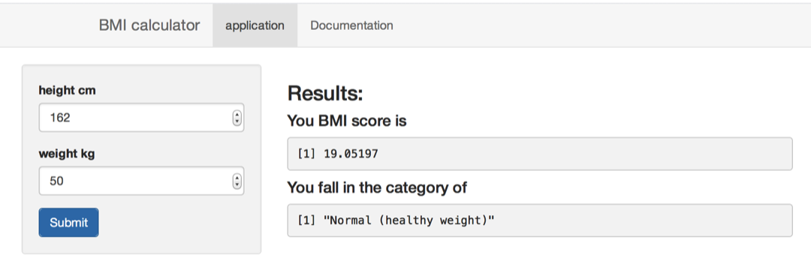

## About Body Mass Index

1. The body mass index (BMI) or Quetelet index, is a value derived from the mass (weight) and height of an individual.
2. The BMI is an attempt to quantify the amount of tissue mass (muscle, fat, and bone) in an individual, and then categorize that person as underweight, normal weight, overweight, or obese based on that value.
3.  BMI was designed for population studies, not individuals

--- .class #id

## BMI Calculation

$$ BMI = \frac{weight_{(kg)}}{height_{(m)}^2}$$

Example: 
For a guy with weight as 50 kg, and height as 1.62m, his BMI is


```r
BMI = 50 / (1.62^2)
BMI
```

```
## [1] 19.05197
```

--- .class #id2

## BMI Category

Category   | BMI
-----------|---------
Severely underweight| <16.0
Underweight| 16.0-18.5
Normal     | 18.5 - 25
Overweight | 25-30
Moderately obese | 30-35
Severely obese | 35-40
Very severely obese | >40

--- .class #id3

## Main Application Interface

 

--- .class #id4


